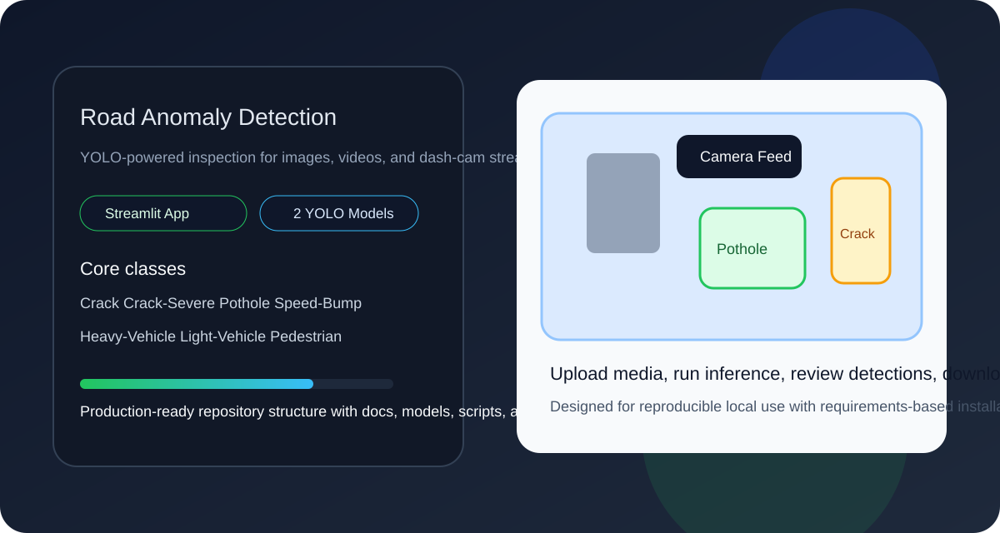
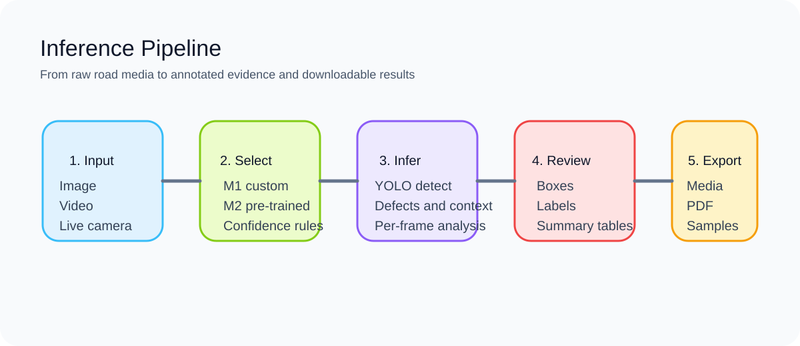
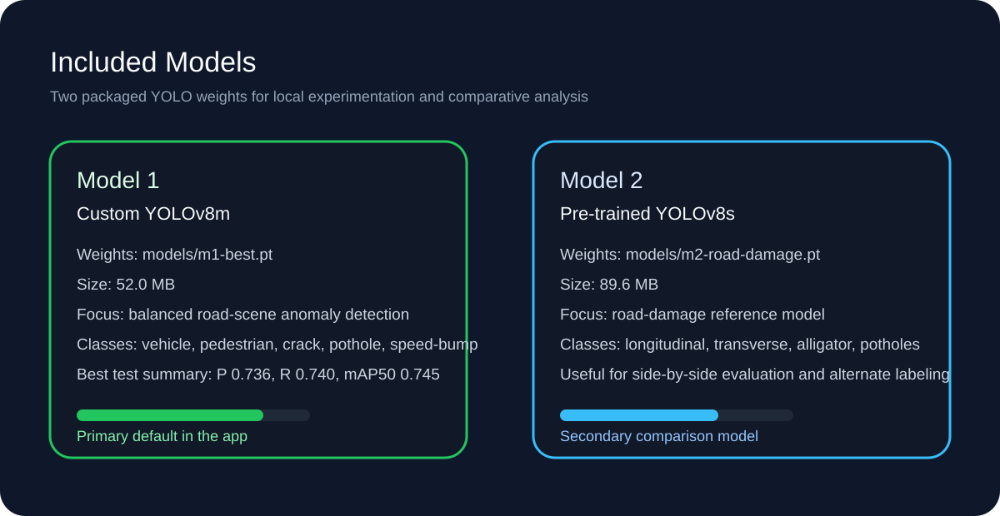
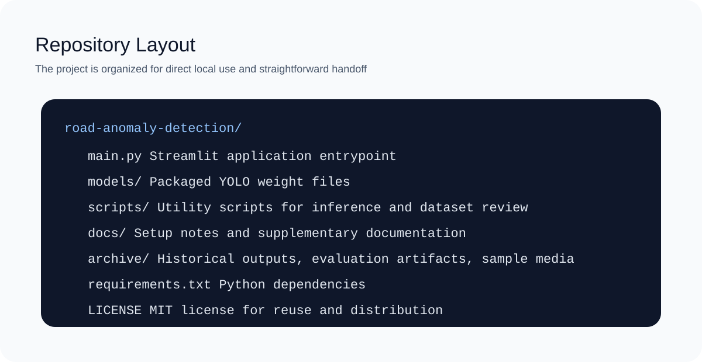
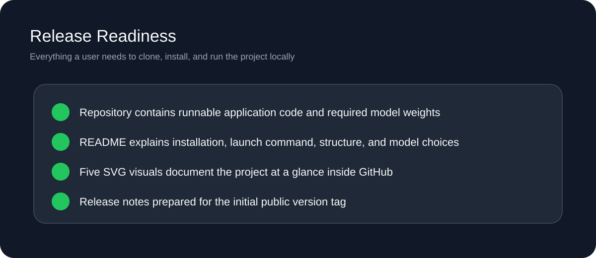

# Road Anomaly Detection

Professional computer-vision project for detecting road anomalies from images, videos, and live camera input using YOLO models. The repository is organized so a user can clone it, install dependencies, and run the Streamlit app directly.

## Repository Description

Road Anomaly Detection is a deployable local inference project that combines a polished Streamlit interface, packaged YOLO model weights, utility scripts, and archived evaluation artifacts for road-surface defect analysis.

## Project Visuals







## Highlights

- Streamlit application for image, video, and live camera inference
- Two packaged YOLO models for direct local use
- Ready-to-clone repository with setup documentation and release notes
- Sample outputs and archived evaluation assets included for reference
- Utility scripts for standalone inference and annotation inspection

## Included Models

### Model 1

- File: `models/m1-best.pt`
- Type: custom-trained YOLOv8m
- Size: 52.0 MB
- Best suited for the main app workflow and broad anomaly detection

### Model 2

- File: `models/m2-road-damage.pt`
- Type: pre-trained YOLOv8s road-damage model
- Size: 89.6 MB
- Useful for comparison runs and alternate road-damage labeling

## Performance Snapshot

Model 1 test-set summary from the archived evaluation results:

| Metric | Value |
| --- | --- |
| Precision | 0.736 |
| Recall | 0.740 |
| mAP@0.5 | 0.745 |
| mAP@0.5:0.95 | 0.448 |

Primary classes covered by the main application:

- Heavy-Vehicle
- Light-Vehicle
- Pedestrian
- Crack
- Crack-Severe
- Pothole
- Speed-Bump

## Quick Start

### 1. Clone the repository

```bash
git clone <repository-url>
cd road-anomaly-detection
```

### 2. Create a virtual environment

```bash
python -m venv .venv
```

Windows:

```powershell
.venv\Scripts\Activate.ps1
```

macOS or Linux:

```bash
source .venv/bin/activate
```

### 3. Install dependencies

```bash
pip install -r requirements.txt
```

If you want a CUDA-specific PyTorch build for local GPU usage, install the matching `torch`, `torchvision`, and `torchaudio` packages first, then run the requirements install.

### 4. Run the app

```bash
python -m streamlit run main.py
```

The app opens a local interface where you can upload images, upload videos, or use a live camera feed.

## Repository Structure

```text
road-anomaly-detection/
|-- main.py
|-- models/
|-- scripts/
|-- docs/
|-- archive/
|-- requirements.txt
|-- LICENSE
|-- RELEASE_NOTES.md
```

## Key Files

- `main.py`: main Streamlit application
- `models/`: packaged weights used by the app
- `scripts/run.py`: standalone single-model inference helper
- `scripts/run2model.py`: dual-model comparison helper
- `scripts/visualize_annotations_data.py`: annotation visualization utility
- `docs/setup.md`: setup instructions
- `docs/web-interface.md`: older Flask interface notes
- `archive/`: sample outputs, evaluation plots, and historical assets

## Release Information

The first public release for this repository is prepared as `v1.0.0`. Release notes are stored in [`RELEASE_NOTES.md`](RELEASE_NOTES.md).

## License

This project is distributed under the MIT License. See [`LICENSE`](LICENSE).
